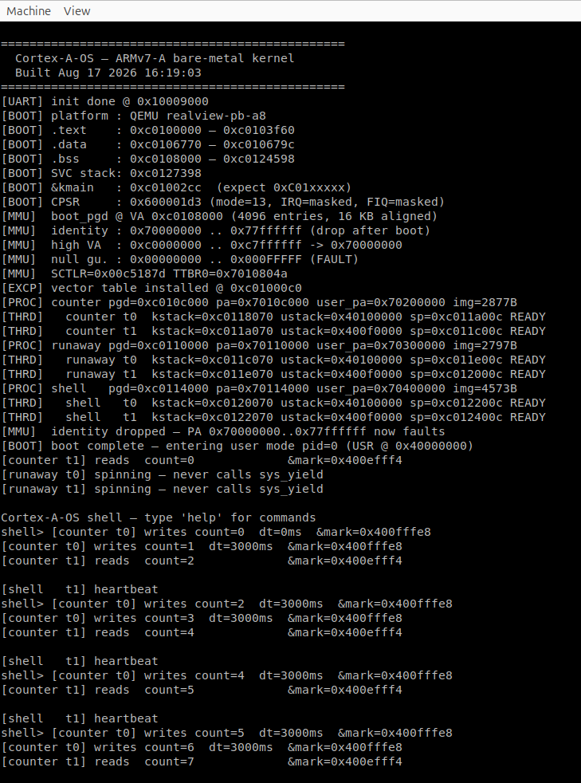

# Cortex-A-OS

> Bare-metal ARMv7-A kernel written from scratch. 3 user processes, 2 threads
> each, scheduled preemptively through an interactive shell — ~5000 lines of
> C + assembly, no framework.

<div align="center">

### Kiến trúc hệ thống / System Architecture


*Tổng quan các thành phần kernel: boot → MMU → scheduler → syscall → userspace*

---

### Log khởi động / Boot Log



*Quá trình boot trên QEMU realview-pb-a8: từ start.S → MMU → scheduler → shell prompt*

</div>

[English](#english) · [Tiếng Việt](#tiếng-việt)

---

## English

### Status

Runs end-to-end on both **QEMU realview-pb-a8** and **BeagleBone Black**:
boot → MMU → preemptive scheduler → syscall ABI → shell with 6 commands. One
codebase builds for both; the target is picked at build time.

### Environment setup (Ubuntu)

Tested on Ubuntu 22.04.

```bash
sudo apt update
sudo apt install -y build-essential git make                \
                    gcc-arm-none-eabi binutils-arm-none-eabi \
                    gdb-multiarch                            \
                    qemu-system-arm
```

Verify the toolchain:

```bash
arm-none-eabi-gcc --version       # expect GCC 10+
qemu-system-arm --version         # expect QEMU 6+
make --version
```

Clone the repo with the bootloader submodule (required only for the BBB
target):

```bash
git clone --recursive <url> Cortex-A-OS
cd Cortex-A-OS
# or, if already cloned without --recursive:
git submodule update --init --recursive
```

### Build and run

```bash
make                          # build for QEMU (default)
bash scripts/qemu/run.sh      # interactive — shell prompt after ~1 s
```

Quit QEMU: `Ctrl+A` then `x`.

```bash
make PLATFORM=bbb                       # build kernel.bin + MLO (SPL)
sudo bash scripts/bbb/flash.sh /dev/sdX # write SD: MLO to FAT, kernel raw @ sector 2048
# insert SD into BBB, UART0 @ 115200 8N1, power on
```

### Demo

At the `shell>` prompt:

| Command       | Effect                                                                |
| ------------- | --------------------------------------------------------------------- |
| `help`        | List 6 commands                                                       |
| `ps`          | Show name + state of 6 threads (3 processes × 2 threads each)         |
| `kill <pid>`  | Mark process DEAD; scheduler skips                                    |
| `echo <text>` | Print back                                                            |
| `clear`       | ANSI clear screen                                                     |
| `crash`       | Shell NULL-deref → fault-isolation demo (kernel + counter stay alive) |

### Architecture

```text
┌───────────────────────────────────────────────┐
│              USERSPACE (USR)                  │
│   counter   ·   runaway   ·   shell           │
│        │           │            │             │
│        └─── crt0 + libc + svc ──┘             │
├───────────────────────────────────────────────┤
│             KERNEL CORE (SVC)                 │
│   Scheduler  ·  Process  ·  Syscall           │
│   Context switch  ·  Exception + MMU          │
├───────────────────────────────────────────────┤
│           SUBSYSTEMS (drivers/*)              │
│   uart_core  ·  timer_core  ·  intc_core      │
│   (dispatch via struct *_ops)                 │
├───────────────────────────────────────────────┤
│     CHIP DRIVERS         │   BOARD WIRE-UP    │
│   PL011 · NS16550        │   platform/qemu/   │
│   SP804 · DMTIMER        │   platform/bbb/    │
│   GIC v1 · AM335x INTC   │   (board.c picks   │
│                          │    which chip)     │
├───────────────────────────────────────────────┤
│                 HARDWARE                      │
│      ARMv7-A Cortex-A8 / DDR / UART           │
└───────────────────────────────────────────────┘
```

Kernel core depends only on the `drivers/<subsys>.h` contracts (`struct
*_ops`). Adding a new board means creating `platform/<name>/board.c` +
`platform.mk` listing the chip drivers; the core is untouched. User space
links at VA `0x40000000`, kernel links at `KERNEL_VIRT_BASE = 0xC0000000`
(Linux-style ARM 3G/1G split). Each process has its own 16 KB page table,
8 KB kernel stack, and 1 MB user physical slot — process A crashing cannot
corrupt B or C.

### Core topics

Full technical design — boot, MMU, exceptions, process/thread model,
scheduler, syscall ABI, userspace, shell — is written up in
[docs/os-design.md](docs/os-design.md).
Memory layout: [docs/address-space-design.md](docs/address-space-design.md).

### Toolchain

- `arm-none-eabi-gcc`, GNU Binutils, GDB
- QEMU `qemu-system-arm` (machine `realview-pb-a8`)
- GNU Make

No external libraries.

### Code layout

```text
kernel/
├── main.c
├── arch/arm/                  # boot, exception, mmu, context switch
├── proc/ sched/ syscall/      # core kernel — platform-agnostic
├── drivers/                   # subsystem + chip drivers (Linux-style)
│   ├── uart/                  # uart_core + pl011 + ns16550
│   ├── timer/                 # timer_core + sp804 + dmtimer
│   └── intc/                  # intc_core + gicv1 + am335x_intc
├── platform/                  # board wire-up only
│   ├── qemu/                  # board.h, board.c, platform.mk, periph_map.c
│   └── bbb/                   # same layout, different chips + addresses
├── include/
│   ├── drivers/               # struct *_ops contracts
│   └── *.h                    # kernel API (proc, scheduler, syscall, ...)
└── linker/                    # per-platform linker scripts

user/
├── crt0.S                     # entry: bl main → sys_exit
├── libc/                      # syscall wrappers + minimal string/print
├── linker/user.ld             # link at 0x40000000
└── apps/                      # counter, runaway, shell

bootloader/                    # BBB SPL → builds MLO, loads kernel from SD
docs/                          # architecture + per-chapter walkthroughs
scripts/qemu/ scripts/bbb/     # launcher + SD flasher
```

### Out of scope

- `fork` / `exec` — processes are created at boot, static
- Filesystem, VFS, networking
- POSIX, signals, pipes, sockets
- Dynamic allocation (`kmalloc`), page allocator
- SMP (single-core only)
- IPC (shared memory / message passing)
- Display, HDMI

A learning kernel — minimal, not production. Everything written by hand,
not a Linux clone.

---

## Tiếng Việt

[English](#english) · **Tiếng Việt**

### Trạng thái

Implemented end-to-end trên cả **QEMU realview-pb-a8** và **BeagleBone Black**:
boot → MMU → preemptive scheduler → syscall ABI → shell với 6 lệnh. Cùng
code base chạy trên cả hai — chọn platform tại build time.

### Cài môi trường (Ubuntu)

Đã test trên Ubuntu 22.04.

```bash
sudo apt update
sudo apt install -y build-essential git make                \
                    gcc-arm-none-eabi binutils-arm-none-eabi \
                    gdb-multiarch                            \
                    qemu-system-arm
```

Verify toolchain:

```bash
arm-none-eabi-gcc --version       # cần GCC 10+
qemu-system-arm --version         # cần QEMU 6+
make --version
```

Clone repo kèm submodule bootloader (chỉ cần cho target BBB):

```bash
git clone --recursive <url> Cortex-A-OS
cd Cortex-A-OS
# hoặc nếu đã clone không kèm --recursive:
git submodule update --init --recursive
```

### Build + chạy

```bash
make                          # build QEMU (default)
bash scripts/qemu/run.sh      # chạy interactive — shell prompt sau ~1 s
```

Thoát QEMU: `Ctrl+A` rồi `x`.

```bash
make PLATFORM=bbb                       # build kernel.bin + MLO (SPL)
sudo bash scripts/bbb/flash.sh /dev/sdX # ghi SD card: MLO vào FAT, kernel raw @ sector 2048
# cắm SD vào BBB, UART0 @ 115200 8N1, power on
```

### Demo

Sau khi boot, gõ vào prompt `shell>`:

| Lệnh          | Tác dụng                                                            |
| ------------- | ------------------------------------------------------------------- |
| `help`        | List 6 lệnh                                                         |
| `ps`          | Show name + state của 6 thread (3 process × 2 thread mỗi cái)        |
| `kill <pid>`  | Mark process DEAD, scheduler skip                                   |
| `echo <text>` | Print lại                                                           |
| `clear`       | ANSI clear screen                                                   |
| `crash`       | Shell NULL-deref → fault isolation demo (kernel + counter vẫn chạy) |

### Kiến trúc

```text
┌───────────────────────────────────────────────┐
│              USERSPACE (USR)                  │
│   counter   ·   runaway   ·   shell           │
│        │           │            │             │
│        └─── crt0 + libc + svc ──┘             │
├───────────────────────────────────────────────┤
│             KERNEL CORE (SVC)                 │
│   Scheduler  ·  Process  ·  Syscall           │
│   Context switch  ·  Exception + MMU          │
├───────────────────────────────────────────────┤
│           SUBSYSTEMS (drivers/*)              │
│   uart_core  ·  timer_core  ·  intc_core      │
│   (dispatch via struct *_ops)                 │
├───────────────────────────────────────────────┤
│     CHIP DRIVERS         │   BOARD WIRE-UP    │
│   PL011 · NS16550        │   platform/qemu/   │
│   SP804 · DMTIMER        │   platform/bbb/    │
│   GIC v1 · AM335x INTC   │   (board.c picks   │
│                          │    which chip)     │
├───────────────────────────────────────────────┤
│                 HARDWARE                      │
│      ARMv7-A Cortex-A8 / DDR / UART           │
└───────────────────────────────────────────────┘
```

Kernel core depend duy nhất trên `drivers/<subsys>.h` contract (struct ops).
Thêm board mới = tạo `platform/<name>/board.c` + `platform.mk` liệt kê chip
drivers; không đụng core. User link tại VA `0x40000000`, kernel link tại
`KERNEL_VIRT_BASE = 0xC0000000` (3G/1G split kiểu Linux ARM). Mỗi process có
page table 16 KB + kernel stack 8 KB + user PA slot 1 MB riêng — process A
crash không corrupt B/C.

### Cốt lõi

Thiết kế kỹ thuật đầy đủ — boot, MMU, exception, process/thread model,
scheduler, syscall ABI, userspace, shell — nằm trong
[docs/os-design.md](docs/os-design.md).
Memory layout chi tiết: [docs/address-space-design.md](docs/address-space-design.md).

### Toolchain

- `arm-none-eabi-gcc`, GNU Binutils, GDB
- QEMU `qemu-system-arm` (machine `realview-pb-a8`)
- GNU Make

Không phụ thuộc thư viện ngoài.

### Tổ chức code

```text
kernel/
├── main.c
├── arch/arm/                  # boot, exception, mmu, context switch
├── proc/ sched/ syscall/      # core kernel — platform-agnostic
├── drivers/                   # subsystem + chip drivers (Linux-style)
│   ├── uart/                  # uart_core + pl011 + ns16550
│   ├── timer/                 # timer_core + sp804 + dmtimer
│   └── intc/                  # intc_core + gicv1 + am335x_intc
├── platform/                  # board wire-up only
│   ├── qemu/                  # board.h, board.c, platform.mk, periph_map.c
│   └── bbb/                   # same layout, different chips + addresses
├── include/
│   ├── drivers/               # struct *_ops contract per subsystem
│   └── *.h                    # kernel API (proc, scheduler, syscall, ...)
└── linker/                    # per-platform linker scripts

user/
├── crt0.S                     # entry: bl main → sys_exit
├── libc/                      # syscall wrappers + minimal string/print
├── linker/user.ld             # link tại 0x40000000
└── apps/                      # counter, runaway, shell

bootloader/                    # BBB SPL → builds MLO, loads kernel from SD
docs/                          # architecture + per-chapter walkthroughs
scripts/qemu/ scripts/bbb/     # launcher + SD flasher
```

### Out of scope

- `fork` / `exec` (process tạo lúc boot, static)
- Filesystem, VFS, networking
- POSIX, signals, pipe, socket
- Dynamic allocation (`kmalloc`), page allocator
- SMP (single-core only)
- IPC (shared memory / message passing)
- Display, HDMI

Đây là kernel học thuật — minimal, không production. Toàn bộ tự viết, không
clone Linux.
